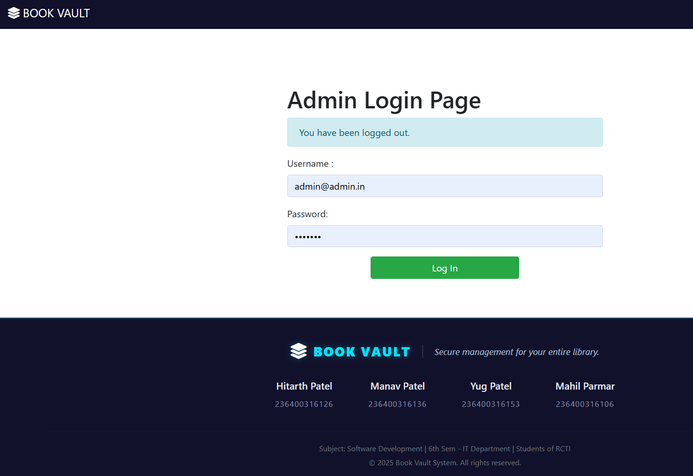
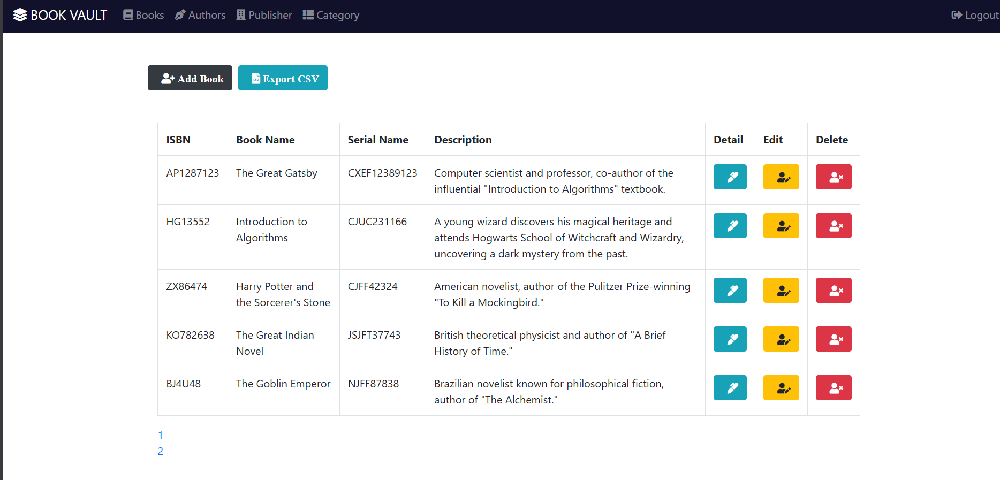
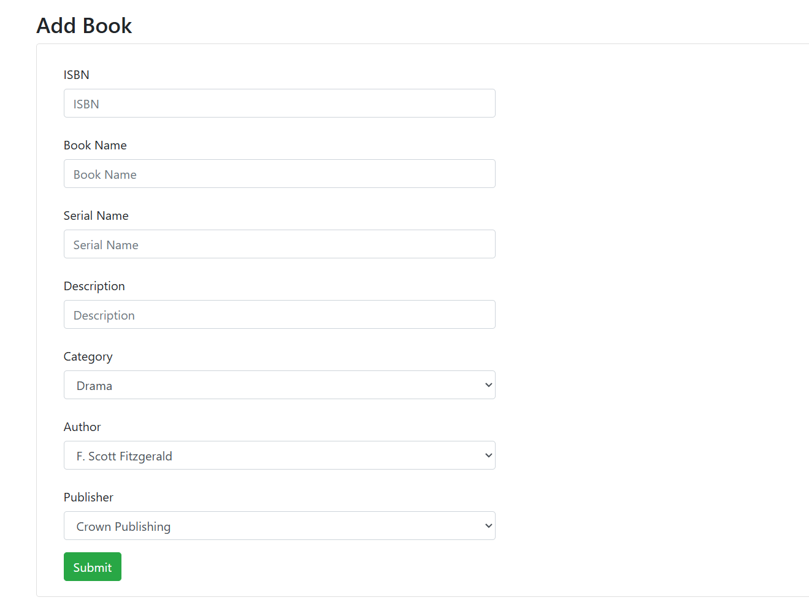
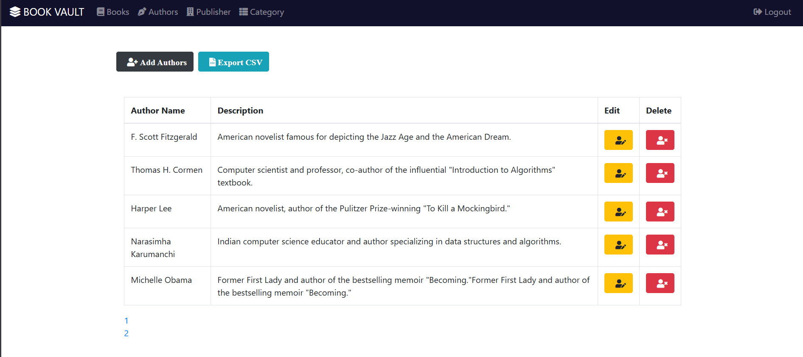
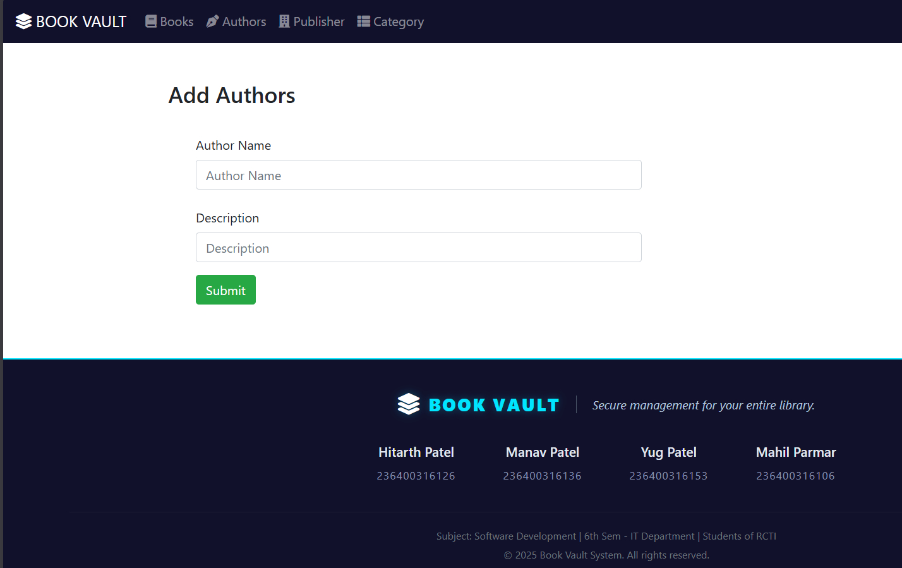
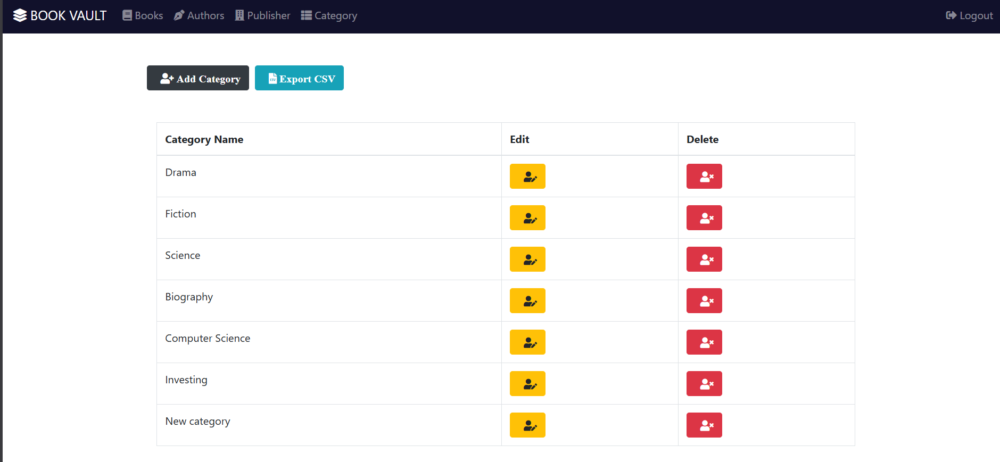
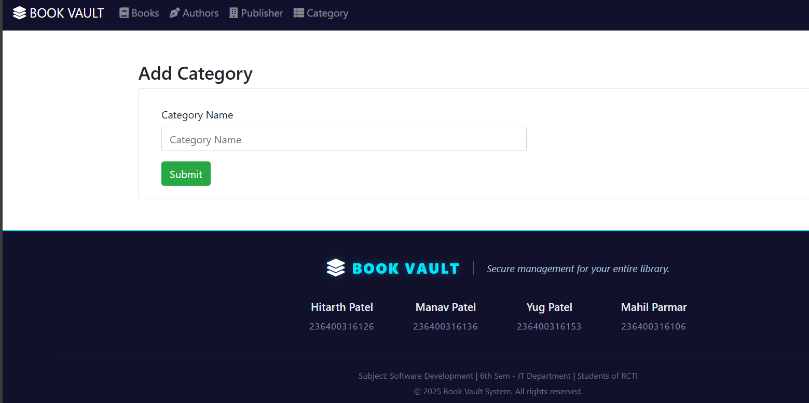
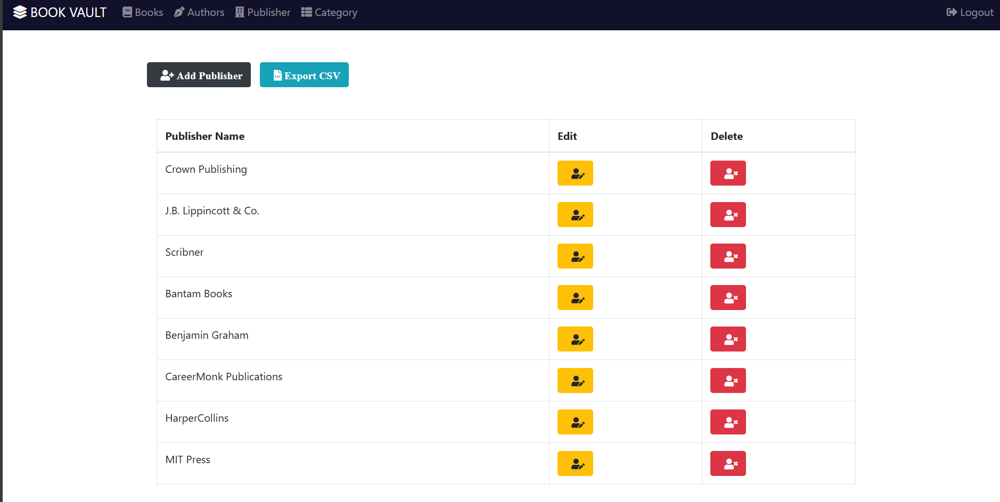
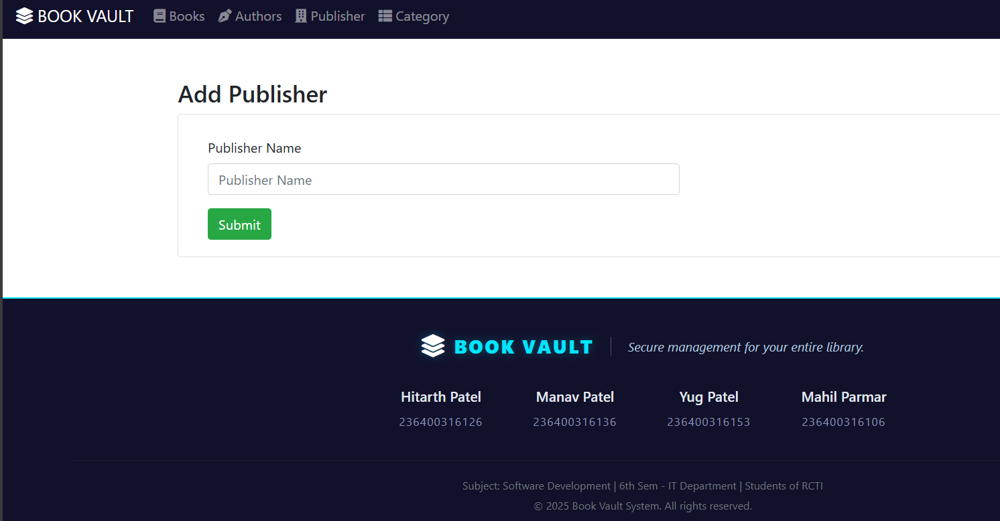

# 📚 Book Vault - Library Management System

> A robust, secure web application built to streamline the daily operations of a modern library, including book inventory, author tracking, and administrative controls.

## 🎯 Project Objective
The primary goal of this micro-project is to develop a secure, efficient, and user-friendly Library Management System using Java and the Spring Boot framework. It provides full **CRUD** (Create, Read, Update, Delete) operations for managing library resources effectively.

## ⚙️ Technology Stack
* **Backend:** Java 17, Spring Boot
* **Build Tool:** Apache Maven
* **IDE:** IntelliJ IDEA / Eclipse / VS Code
* **Database:** H2 (In-Memory Database)

---

## 🚀 Key Features / Modules
1.  **Secure Admin Access:** Protected login portal for administrators.
2.  **Book Management:** Add, update, view, and delete books from the inventory.
3.  **Author Records:** Maintain a database of authors and their details.
4.  **Category Sorting:** Organize books by subject and genre.
5.  **Publisher Directory:** Keep track of book publishers.

---

## 🛠️ Local Setup & Installation

Follow these steps to run the project on your local machine:

**Prerequisites:**
* Ensure [JDK 17](https://www.oracle.com/java/technologies/javase/jdk17-archive-downloads.html) is installed.
* Ensure [Apache Maven](https://maven.apache.org/install.html) is installed.

**Execution Steps:**
1.  **Clone the Repository:** Download the source code to your local machine.
2.  **Clean and Install:** Open your terminal in the project folder and run:
    `mvn clean install`
3.  **Run the Application:** Start the Spring Boot server by running:
    `mvn spring-boot:run`
4.  **Access the App:** Open your web browser and navigate to:
    `http://localhost:9080`

---

## 🔐 Default Admin Credentials
To access the dashboard, use the following login details:
* **Username:** `admin@admin.in`
* **Password:** `Temp123`

---

## 📸 Project Screenshots

### Admin Login Interface

### Dashboard & Book Management

  

### Author Management

  

### Category Management

  

### Publisher Management

  

